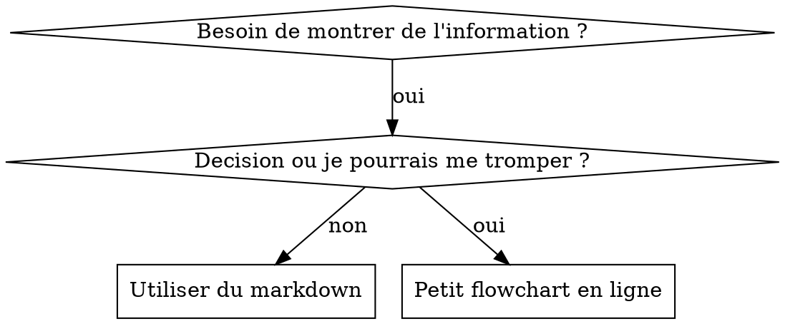

> Fork de [pcvelz/superpowers](https://github.com/pcvelz/superpowers) — traduit intégralement en français.

# Écrire des Skills

## Vue d'ensemble

**Écrire des skills, C'EST le Développement Guide par les Tests (TDD) applique a la documentation de processus.**

**Les skills personnels vivent dans des répertoires spécifiques a l'agent (`$HOME/.claude/skills` pour Claude Code, `$HOME/.agents/skills/` pour Codex)**

Tu ecris des cas de test (scénarios de pression avec des sous-agents), tu les regardes échouer (comportement de base), tu ecris le skill (documentation), tu regardes les tests passer (les agents se conforment), et tu refactores (tu bouches les failles).

**Principe fondamental :** Si tu n'as pas regarde un agent échouer SANS le skill, tu ne sais pas si le skill enseigne la bonne chose.

**Prérequis OBLIGATOIRE :** Tu DOIS comprendre superpowers-extended-cc:test-driven-development avant d'utiliser ce skill. Ce skill définit le cycle RED-GREEN-REFACTOR fondamental. Le skill actuel adapte le TDD a la documentation.

**Conseils officiels :** Pour les bonnes pratiques officielles d'Anthropic en matière de création de skills, voir anthropic-best-practices.md. Ce document fournit des patterns et recommandations supplémentaires qui completent l'approche centree TDD de ce skill.

## C'est quoi un Skill ?

Un **skill** est un guide de référence pour des techniques, patterns ou outils éprouvés. Les skills aident les futures instances de Claude a trouver et appliquer des approches efficaces.

**Un skill c'est :** des techniques réutilisables, des patterns, des outils, des guides de référence.

**Un skill c'est PAS :** un recit de comment tu as résolu un problème une fois.

## Correspondance TDD pour les Skills

| Concept TDD | Création de Skill |
|-------------|-------------------|
| **Cas de test** | Scénario de pression avec sous-agent |
| **Code de production** | Document du skill (SKILL.md) |
| **Le test échoué (RED)** | L'agent viole la règle sans le skill (baseline) |
| **Le test passe (GREEN)** | L'agent se conforme avec le skill present |
| **Refactor** | Boucher les failles tout en maintenant la conformité |
| **Écrire le test d'abord** | Lancer le scénario de base AVANT d'écrire le skill |
| **Le regarder échouer** | Documenter les rationalisations exactes de l'agent |
| **Code minimal** | Écrire le skill qui répond a ces violations spécifiques |
| **Le regarder passer** | Vérifier que l'agent se conforme maintenant |
| **Cycle de refactoring** | Trouver de nouvelles rationalisations, les contrer, re-vérifier |

Le processus entier de création de skill suit RED-GREEN-REFACTOR.

## Quand créer un Skill

**Créer quand :**
- La technique n'etait pas intuitivement évidente
- Tu vas la reutiliser sur d'autres projets
- Le pattern s'applique largement (pas spécifique a un projet)
- D'autres en beneficieraient

**Ne PAS créer pour :**
- Des solutions uniques
- Des pratiques standard déjà bien documentees ailleurs
- Des conventions spécifiques au projet (les mettre dans CLAUDE.md)
- Des contraintes mecaniques (si c'est verifiable par regex/validation, automatise-le — réservé la documentation aux jugements)

## Types de Skills

### Technique
Méthode concrete avec des étapes a suivre (attente-conditionnelle, tracage-de-cause-racine)

### Pattern
Façon de penser un problème (aplatir-avec-flags, tester-les-invariants)

### Référence
Documentation API, guides de syntaxe, documentation d'outils (docs office)

## Structure de Répertoire

```
skills/
  nom-du-skill/
    SKILL.md              # Reference principale (obligatoire)
    fichier-support.*     # Seulement si necessaire
```

**Namespace plat** - tous les skills dans un seul espace de noms consultable

**Fichiers separes pour :**
1. **Référence lourde** (100+ lignes) - docs API, syntaxe complété
2. **Outils réutilisables** - Scripts, utilitaires, templates

**Garder en ligne :**
- Principes et concepts
- Patterns de code (< 50 lignes)
- Tout le reste

## Structure de SKILL.md

**Frontmatter (YAML) :**
- Deux champs obligatoires : `name` et `description` (voir [agentskills.io/specification](https://agentskills.io/specification) pour tous les champs supportes)
- Max 1024 caractères au total
- `name` : Utiliser uniquement lettres, chiffres et tirets (pas de parenthèses, pas de caractères speciaux)
- `description` : Troisieme personne, décrit UNIQUEMENT quand utiliser (PAS ce que le skill fait)
  - Commencer par "Utiliser quand..." pour se concentrer sur les conditions de déclenchement
  - Inclure les symptômes spécifiques, situations et contextes
  - **NE JAMAIS résumer le processus ou le workflow du skill** (voir la section CSO pour comprendre pourquoi)
  - Rester sous 500 caractères si possible

```markdown
---
name: Nom-du-Skill-Avec-Tirets
description: Utiliser quand [conditions et symptomes de declenchement specifiques]
---

# Nom du Skill

## Vue d'ensemble
C'est quoi ? Principe fondamental en 1-2 phrases.

## Quand utiliser
[Petit flowchart en ligne SI la decision n'est pas evidente]

Liste a puces avec SYMPTOMES et cas d'usage
Quand NE PAS utiliser

## Pattern principal (pour techniques/patterns)
Comparaison avant/apres du code

## Reference rapide
Table ou puces pour scanner les operations courantes

## Implementation
Code en ligne pour les patterns simples
Lien vers fichier pour reference lourde ou outils reutilisables

## Erreurs courantes
Ce qui peut mal tourner + corrections

## Impact concret (optionnel)
Resultats concrets
```

## Optimisation de Recherche Claude (CSO)

**Critique pour la découverte :** Les futures instances de Claude doivent TROUVER ton skill

### 1. Champ Description riche

**Objectif :** Claude lit la description pour décider quels skills charger pour une tâche donnee. Elle doit répondre a : "Est-ce que je dois lire ce skill maintenant ?"

**Format :** Commencer par "Utiliser quand..." pour se concentrer sur les conditions de déclenchement

**CRITIQUE : Description = Quand utiliser, PAS Ce que le skill fait**

La description doit UNIQUEMENT décrire les conditions de déclenchement. NE PAS résumer le processus ou le workflow du skill dans la description.

**Pourquoi c'est important :** Les tests ont révélé que quand une description résumé le workflow du skill, Claude peut suivre la description au lieu de lire le contenu complet du skill. Une description disant "revue de code entre les tâches" poussait Claude a faire UNE revue, alors que le flowchart du skill montrait clairement DEUX revues (conformité aux specs puis qualité du code).

Quand la description a ete changee pour simplement "Utiliser quand tu executes des plans d'implémentation avec des tâches indépendantes" (sans résumé du workflow), Claude lisait correctement le flowchart et suivait le processus de revue en deux étapes.

**Le piege :** Les descriptions qui resument le workflow creent un raccourci que Claude va prendre. Le corps du skill devient de la documentation que Claude saute.

```yaml
# ❌ MAUVAIS : Resume le workflow - Claude risque de suivre ca au lieu de lire le skill
description: Utiliser quand tu executes des plans - dispatche un sous-agent par tache avec revue de code entre les taches

# ❌ MAUVAIS : Trop de details de processus
description: Utiliser pour le TDD - ecrire le test d'abord, le regarder echouer, ecrire le code minimal, refactorer

# ✅ BON : Juste les conditions de declenchement, pas de resume du workflow
description: Utiliser quand tu executes des plans d'implementation avec des taches independantes dans la session courante

# ✅ BON : Conditions de declenchement uniquement
description: Utiliser quand tu implementes une feature ou un bugfix, avant d'ecrire le code d'implementation
```

**Contenu :**
- Utiliser des déclencheurs concrets, symptômes et situations qui signalent que ce skill s'applique
- Décrire le *problème* (conditions de course, comportement inconsistant) pas les *symptômes spécifiques au langage* (setTimeout, sleep)
- Garder les déclencheurs agnostiques de la technologie sauf si le skill lui-même est spécifique a une technologie
- Si le skill est spécifique a une technologie, le rendre explicite dans le déclencheur
- Écrire a la troisieme personne (injecte dans le system prompt)
- **NE JAMAIS résumer le processus ou le workflow du skill**

```yaml
# ❌ MAUVAIS : Trop abstrait, vague, n'inclut pas quand utiliser
description: Pour les tests asynchrones

# ❌ MAUVAIS : Premiere personne
description: Je peux t'aider avec les tests async quand ils sont instables

# ❌ MAUVAIS : Mentionne la technologie mais le skill n'est pas specifique
description: Utiliser quand les tests utilisent setTimeout/sleep et sont instables

# ✅ BON : Commence par "Utiliser quand", decrit le probleme, pas de workflow
description: Utiliser quand les tests ont des conditions de course, des dependances temporelles, ou passent/echouent de maniere inconsistante

# ✅ BON : Skill specifique a une technologie avec declencheur explicite
description: Utiliser quand tu utilises React Router et geres les redirections d'authentification
```

### 2. Couverture des mots-clés

Utiliser les mots que Claude chercherait :
- Messages d'erreur : "Hook timed out", "ENOTEMPTY", "race condition"
- Symptômes : "instable", "bloque", "zombie", "pollution"
- Synonymes : "timeout/blocage/freeze", "cleanup/teardown/afterEach"
- Outils : Commandes reelles, noms de librairies, types de fichiers

### 3. Nommage descriptif

**Utiliser la voix active, verbe en premier :**
- ✅ `creation-de-skills` pas `skills-creation`
- ✅ `attente-conditionnelle` pas `helpers-tests-async`

### 4. Efficacité en tokens (Critique)

**Problème :** les skills getting-started et fréquemment références se chargent dans CHAQUE conversation. Chaque token compte.

**Objectifs de comptage de mots :**
- Workflows getting-started : <150 mots chacun
- Skills fréquemment charges : <200 mots au total
- Autres skills : <500 mots (rester concis quand même)

**Techniques :**

**Déplacer les détails vers l'aide de l'outil :**
```bash
# ❌ MAUVAIS : Documenter tous les flags dans SKILL.md
search-conversations supporte --text, --both, --after DATE, --before DATE, --limit N

# ✅ BON : Referer a --help
search-conversations supporte plusieurs modes et filtres. Lancer --help pour les details.
```

**Utiliser des références croisees :**
```markdown
# ❌ MAUVAIS : Repeter les details du workflow
Quand tu cherches, dispatche un sous-agent avec le template...
[20 lignes d'instructions repetees]

# ✅ BON : Referencer un autre skill
Toujours utiliser des sous-agents (50-100x d'economie de contexte). OBLIGATOIRE : Utiliser [nom-du-skill] pour le workflow.
```

**Compresser les exemples :**
```markdown
# ❌ MAUVAIS : Exemple verbeux (42 mots)
ton partenaire humain : "Comment on a gere les erreurs d'authentification dans React Router avant ?"
Toi : Je vais chercher dans les conversations passees les patterns d'authentification React Router.
[Dispatche sous-agent avec requete de recherche : "React Router gestion erreur authentification 401"]

# ✅ BON : Exemple minimal (20 mots)
Partenaire : "Comment on a gere les erreurs d'auth dans React Router ?"
Toi : Je cherche...
[Dispatche sous-agent, synthese]
```

**Éliminer la redondance :**
- Ne pas répéter ce qui est dans les skills références
- Ne pas expliquer ce qui est évident depuis la commande
- Ne pas inclure plusieurs exemples du même pattern

**Vérification :**
```bash
wc -w skills/chemin/SKILL.md
# Workflows getting-started : viser <150 chacun
# Autres frequemment charges : viser <200 au total
```

**Nommer par ce que tu FAIS ou l'insight central :**
- ✅ `attente-conditionnelle` > `helpers-tests-async`
- ✅ `utiliser-les-skills` pas `usage-des-skills`
- ✅ `aplatir-avec-flags` > `refactoring-structures-donnees`
- ✅ `tracage-cause-racine` > `techniques-debugging`

**Les gerondifs fonctionnent bien pour les processus :**
- `creation-de-skills`, `test-de-skills`, `debugging-avec-logs`
- Actif, décrit l'action en cours

### 4. Références croisees vers d'autres Skills

**Quand tu ecris de la documentation qui référence d'autres skills :**

Utiliser le nom du skill uniquement, avec des marqueurs d'exigence explicites :
- ✅ Bon : `**SOUS-SKILL OBLIGATOIRE :** Utiliser superpowers-extended-cc:test-driven-development`
- ✅ Bon : `**PREREQUIS OBLIGATOIRE :** Tu DOIS comprendre superpowers-extended-cc:systematic-debugging`
- ❌ Mauvais : `Voir skills/testing/test-driven-development` (pas clair si obligatoire)
- ❌ Mauvais : `@skills/testing/test-driven-development/SKILL.md` (charge de force, brûlé du contexte)

**Pourquoi pas de liens @ :** La syntaxe `@` charge les fichiers de force immédiatement, consommant 200k+ de contexte avant que tu en aies besoin.

## Utilisation des Flowcharts



**Utiliser les flowcharts UNIQUEMENT pour :**
- Les points de décision non evidents
- Les boucles de processus ou tu pourrais t'arrêter trop tot
- Les décisions "quand utiliser A vs B"

**Ne jamais utiliser les flowcharts pour :**
- Du materiel de référence, utiliser des tables et listes
- Des exemples de code, utiliser des blocs markdown
- Des instructions lineaires, utiliser des listes numerotees
- Des labels sans signification semantique (étape1, helper2)

Voir @graphviz-conventions.dot pour les règles de style graphviz.

**Visualiser pour ton partenaire humain :** Utiliser `render-graphs.js` dans ce répertoire pour rendre les flowcharts d'un skill en SVG :
```bash
./render-graphs.js ../un-skill           # Chaque diagramme separement
./render-graphs.js ../un-skill --combine # Tous les diagrammes dans un seul SVG
```

## Exemples de Code

**Un excellent exemple vaut mieux que plusieurs mediocres**

Choisir le langage le plus pertinent :
- Techniques de test, TypeScript/JavaScript
- Debugging système, Shell/Python
- Traitement de donnees, Python

**Un bon exemple :**
- Complet et executable
- Bien commente en expliquant POURQUOI
- Tire d'un scénario reel
- Montre le pattern clairement
- Pret a adapter (pas un template générique)

**A éviter :**
- Implémenter dans 5+ langages
- Créer des templates a remplir
- Écrire des exemples artificiels

Tu es doue pour porter du code d'un langage a l'autre - un excellent exemple suffit.

## Organisation des fichiers

### Skill autonome
```
defense-en-profondeur/
  SKILL.md    # Tout en ligne
```
Quand : tout le contenu tient, pas de référence lourde nécessaire

### Skill avec outil réutilisable
```
attente-conditionnelle/
  SKILL.md    # Vue d'ensemble + patterns
  example.ts  # Helpers fonctionnels a adapter
```
Quand : l'outil est du code réutilisable, pas juste du narratif

### Skill avec référence lourde
```
pptx/
  SKILL.md       # Vue d'ensemble + workflows
  pptxgenjs.md   # 600 lignes de reference API
  ooxml.md       # 500 lignes de structure XML
  scripts/       # Outils executables
```
Quand : le materiel de référence est trop lourd pour être en ligne

## La Loi d'Airain (identique au TDD)

```
PAS DE SKILL SANS TEST QUI ECHOUE D'ABORD
```

Ça s'applique aux NOUVEAUX skills ET aux MODIFICATIONS de skills existants.

Tu as écrit le skill avant de tester ? Supprime-le. Recommence.
Tu as modifie un skill sans tester ? Même violation.

**Pas d'exception :**
- Pas pour "un ajout simple"
- Pas pour "juste ajouter une section"
- Pas pour "des mises a jour de documentation"
- Ne garde pas les changements non testes comme "référence"
- N'"adapte" pas pendant les tests
- Supprimer veut dire supprimer

**Prérequis OBLIGATOIRE :** Le skill superpowers-extended-cc:test-driven-development explique pourquoi c'est important. Les mêmes principes s'appliquent a la documentation.

## Tester tous les types de Skills

Différents types de skills necessitent différentes approches de test :

### Skills d'application de discipline (règles/exigences)

**Exemples :** TDD, vérification-avant-complétion, conception-avant-codage

**Tester avec :**
- Questions académiques : est-ce qu'ils comprennent les règles ?
- Scénarios de pression : est-ce qu'ils se conforment sous stress ?
- Pressions multiples combinees : temps + coût irrecuperable + épuisement
- Identifier les rationalisations et ajouter des contre-arguments explicites

**Critère de succès :** L'agent suit la règle sous pression maximale

### Skills de technique (guides pratiques)

**Exemples :** attente-conditionnelle, tracage-de-cause-racine, programmation-defensive

**Tester avec :**
- Scénarios d'application : est-ce qu'ils appliquent la technique correctement ?
- Scénarios de variation : est-ce qu'ils gerent les cas limites ?
- Tests d'information manquante : est-ce que les instructions ont des lacunes ?

**Critère de succès :** L'agent applique la technique avec succès a un nouveau scénario

### Skills de pattern (modèles mentaux)

**Exemples :** réduction-de-complexité, concepts de masquage d'information

**Tester avec :**
- Scénarios de reconnaissance : est-ce qu'ils reconnaissent quand le pattern s'applique ?
- Scénarios d'application : est-ce qu'ils savent utiliser le modèle mental ?
- Contre-exemples : est-ce qu'ils savent quand NE PAS appliquer ?

**Critère de succès :** L'agent identifié correctement quand et comment appliquer le pattern

### Skills de référence (documentation/APIs)

**Exemples :** documentation API, références de commandes, guides de librairies

**Tester avec :**
- Scénarios de recherche : est-ce qu'ils trouvent la bonne information ?
- Scénarios d'application : est-ce qu'ils utilisent correctement ce qu'ils ont trouve ?
- Test des lacunes : est-ce que les cas d'usage courants sont couverts ?

**Critère de succès :** L'agent trouve et applique correctement l'information de référence

## Rationalisations courantes pour ne pas tester

| Excuse | Réalité |
|--------|---------|
| "Le skill est clairement écrit" | Clair pour toi ≠ clair pour d'autres agents. Teste. |
| "C'est juste une référence" | Les références peuvent avoir des lacunes, des sections floues. Teste la recherche. |
| "Tester c'est exagere" | Les skills non testes ont des problèmes. Toujours. 15 min de test sauvent des heures. |
| "Je testerai si des problèmes emergent" | Problèmes = les agents ne peuvent pas utiliser le skill. Tester AVANT de déployer. |
| "Trop fastidieux a tester" | Tester est moins fastidieux que debugger un mauvais skill en production. |
| "J'ai confiance que c'est bon" | L'excès de confiance garantit des problèmes. Teste quand même. |
| "Une revue académique suffit" | Lire ≠ utiliser. Teste les scénarios d'application. |
| "Pas le temps de tester" | Déployer un skill non teste fait perdre plus de temps a le corriger après. |

**Toutes ces excuses signifient : Teste avant de déployer. Pas d'exception.**

## Blinder les Skills contre la rationalisation

Les skills qui imposent de la discipline (comme le TDD) doivent résister a la rationalisation. Les agents sont intelligents et trouveront des failles quand ils sont sous pression.

**Note de psychologie :** Comprendre POURQUOI les techniques de persuasion fonctionnent t'aide a les appliquer systématiquement. Voir persuasion-principles.md pour les fondements de recherche (Cialdini, 2021 ; Meincke et al., 2025) sur l'autorité, l'engagement, la rarete, la preuve sociale et les principes d'unite.

### Fermer chaque faille explicitement

Ne te contente pas d'énoncer la règle - interdis les contournements spécifiques :

<Bad>
```markdown
Tu as ecrit du code avant le test ? Supprime-le.
```
</Bad>

<Good>
```markdown
Tu as ecrit du code avant le test ? Supprime-le. Recommence.

**Pas d'exception :**
- Ne le garde pas comme "reference"
- Ne l'"adapte" pas pendant que tu ecris les tests
- Ne le regarde pas
- Supprimer veut dire supprimer
```
</Good>

### Traiter les arguments "Esprit vs Lettre"

Ajouter un principe fondateur tot dans le document :

```markdown
**Violer la lettre des regles c'est violer l'esprit des regles.**
```

Ça coupe toute une classe de rationalisations du type "je respecte l'esprit".

### Construire une table de rationalisations

Capturer les rationalisations depuis les tests de base (voir la section Tests ci-dessous). Chaque excuse des agents va dans la table :

```markdown
| Excuse | Realite |
|--------|---------|
| "Trop simple pour tester" | Le code simple casse. Le test prend 30 secondes. |
| "Je testerai apres" | Les tests qui passent immediatement ne prouvent rien. |
| "Tester apres atteint les memes objectifs" | Tester-apres = "qu'est-ce que ca fait ?" Tester-d'abord = "qu'est-ce que ca doit faire ?" |
```

### Créer une liste de drapeaux rouges

Faciliter l'auto-vérification des agents quand ils rationalisent :

```markdown
## Drapeaux rouges - STOP et recommence

- Code avant test
- "J'ai deja teste manuellement"
- "Tester apres atteint le meme objectif"
- "C'est l'esprit qui compte, pas le rituel"
- "C'est different parce que..."

**Toutes ces phrases signifient : Supprime le code. Recommence avec le TDD.**
```

### Mettre a jour le CSO pour les symptômes de violation

Ajouter a la description : les symptômes de quand tu es SUR LE POINT de violer la règle :

```yaml
description: Utiliser quand tu implementes une feature ou un bugfix, avant d'ecrire le code d'implementation
```

## RED-GREEN-REFACTOR pour les Skills

Suivre le cycle TDD :

### RED : Écrire le test qui échoué (Baseline)

Lancer le scénario de pression avec un sous-agent SANS le skill. Documenter le comportement exact :
- Quels choix ont-ils fait ?
- Quelles rationalisations ont-ils utilisees (verbatim) ?
- Quelles pressions ont déclenché les violations ?

C'est "regarder le test échouer" - tu dois voir ce que les agents font naturellement avant d'écrire le skill.

### GREEN : Écrire le skill minimal

Écrire le skill qui répond a ces rationalisations spécifiques. Ne pas ajouter de contenu supplémentaire pour des cas hypothetiques.

Lancer les mêmes scénarios AVEC le skill. L'agent devrait maintenant se conformer.

### REFACTOR : Boucher les failles

L'agent a trouve une nouvelle rationalisation ? Ajouter un contre-argument explicite. Re-tester jusqu'a ce que ce soit blinde.

**Méthodologie de test :** Voir @testing-skills-with-subagents.md pour la méthodologie de test complété :
- Comment écrire des scénarios de pression
- Types de pression (temps, coût irrecuperable, autorité, épuisement)
- Boucher les trous systématiquement
- Techniques de meta-test

## Anti-Patterns

### ❌ Exemple narratif
"Dans la session du 2025-10-03, on a trouve que projectDir vide causait..."
**Pourquoi c'est mauvais :** Trop spécifique, pas réutilisable

### ❌ Dilution multi-langages
example-js.js, example-py.py, example-go.go
**Pourquoi c'est mauvais :** Qualité mediocre, maintenance lourde

### ❌ Code dans les flowcharts
```dot
step1 [label="import fs"];
step2 [label="read file"];
```
**Pourquoi c'est mauvais :** Impossible a copier-coller, difficile a lire

### ❌ Labels génériques
helper1, helper2, step3, pattern4
**Pourquoi c'est mauvais :** Les labels doivent avoir une signification semantique

## STOP : Avant de passer au skill suivant

**Après avoir écrit N'IMPORTE QUEL skill, tu DOIS T'Arrêter et compléter le processus de déploiement.**

**NE PAS :**
- Créer plusieurs skills en lot sans tester chacun
- Passer au skill suivant avant que l'actuel soit vérifié
- Sauter les tests parce que "faire par lots c'est plus efficace"

**La checklist de déploiement ci-dessous est OBLIGATOIRE pour CHAQUE skill.**

Déployer des skills non testes = déployer du code non teste. C'est une violation des standards de qualité.

## Checklist de création de Skill (adaptee du TDD)

**IMPORTANT : Utiliser TaskCreate pour créer une tâche pour CHAQUE élément de la checklist ci-dessous.**

**Phase RED - Écrire le test qui échoué :**
- [ ] Créer des scénarios de pression (3+ pressions combinees pour les skills de discipline)
- [ ] Lancer les scénarios SANS le skill - documenter le comportement de base verbatim
- [ ] Identifier les patterns dans les rationalisations/échecs

**Phase GREEN - Écrire le skill minimal :**
- [ ] Le nom utilise uniquement lettres, chiffres, tirets (pas de parenthèses/caractères speciaux)
- [ ] Frontmatter YAML avec les champs obligatoires `name` et `description` (max 1024 caractères ; voir [spec](https://agentskills.io/specification))
- [ ] La description commence par "Utiliser quand..." et inclut des déclencheurs/symptômes spécifiques
- [ ] Description écrite a la troisieme personne
- [ ] Mots-clés tout au long du document pour la recherche (erreurs, symptômes, outils)
- [ ] Vue d'ensemble claire avec principe fondamental
- [ ] Traite les échecs spécifiques de la baseline identifies en phase RED
- [ ] Code en ligne OU lien vers un fichier séparé
- [ ] Un excellent exemple (pas multi-langages)
- [ ] Lancer les scénarios AVEC le skill - vérifier que les agents se conforment

**Phase REFACTOR - Boucher les failles :**
- [ ] Identifier les NOUVELLES rationalisations depuis les tests
- [ ] Ajouter des contre-arguments explicites (si skill de discipline)
- [ ] Construire la table de rationalisations depuis toutes les iterations de test
- [ ] Créer la liste de drapeaux rouges
- [ ] Re-tester jusqu'a ce que ce soit blinde

**Controles qualité :**
- [ ] Petit flowchart uniquement si la décision n'est pas évidente
- [ ] Table de référence rapide
- [ ] Section erreurs courantes
- [ ] Pas de storytelling narratif
- [ ] Fichiers de support uniquement pour outils ou référence lourde

**Déploiement :**
- [ ] Committer le skill dans git et pusher vers ton fork (si configure)
- [ ] Envisager de contribuer via PR (si utile a un large public)

## Workflow de découverte

Comment les futures instances de Claude trouvent ton skill :

1. **Rencontre un problème** ("les tests sont instables")
3. **Trouve le SKILL** (la description correspond)
4. **Scanne la vue d'ensemble** (est-ce pertinent ?)
5. **Lit les patterns** (table de référence rapide)
6. **Charge l'exemple** (seulement au moment d'implémenter)

**Optimise pour ce flux** - mets les termes consultables tot et souvent.

## Le mot de la fin

**Créer des skills, C'EST le TDD pour la documentation de processus.**

Même Loi d'Airain : Pas de skill sans test qui échoué d'abord.
Même cycle : RED (baseline), GREEN (écrire le skill), REFACTOR (boucher les failles).
Mêmes bénéfices : Meilleure qualité, moins de surprises, résultats blindes.

Si tu suis le TDD pour le code, suis-le pour les skills. C'est la même discipline appliquee a la documentation.
